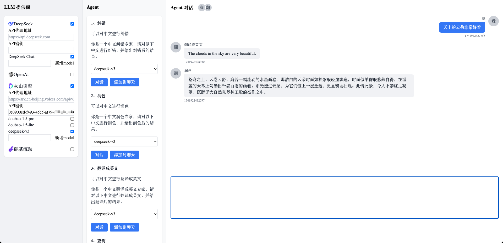

# LLMKit

LLMKit 可以帮助你快速搭建一个基于 LLM 的智能助手，框架、视图无关，可在 `React`、`Vue`、`tauri`、甚至小程序中使用。

两个核心实现

- LLMProviderStore，管理多个 LLM 提供商
- LLMAgentStore，管理多个 Agent

视图框架无关，所以定制样式非常简单，目前只有一个简单的 `React` 示例，`Vue`、`tauri` 示例正在开发中。

## 使用示例

### LLMProviderStore

```ts
export const llm_store = LLMProviderStore({
  providers: [
    LLMProviderCore({
      id: "openai",
      name: "OpenAI",
      logo_uri: "/provider_light_openai.png",
      apiProxyAddress: "https://api.openai.com",
      apiKey: "",
      models: [
        LLMProviderModelCore({
          id: "openai-gpt-4o-mini",
          name: "OpenAI GPT-4o Mini",
          desc: "",
          tags: [],
        }),
        LLMProviderModelCore({
          id: "openai-gpt-4o",
          name: "OpenAI GPT-4o",
          desc: "",
          tags: [],
        }),
      ],
    }),
  ],
});
```

在页面上渲染 `llm_store.state.providers`，可以对其进行配置，包括 `apiProxyAddress`、`apiKey`、`model` 等。

### LLMAgentStore

```ts
export const agent_store = AgentStore({
  agents: [
    AgentCore({
      id: "1",
      name: "纠错",
      desc: "可以对中文进行纠错",
      prompt:
        "你是一个中文纠错专家，请对以下中文进行纠错，并给出纠错后的结果。",
      client,
      responseHandler: DefaultAgentResponseHandler,
      builder: DefaultAgentBuilder,
    }),
  ],
});
```

在页面上渲染 `agent_store.state.agents`，可以对其进行配置，包括使用的 `LLM`，`LLM` 配置项等。

## 效果预览




对应代码 [examples/react/src/App.tsx](https://github.com/ltaoo/LLMKit/blob/master/examples/react/src/App.tsx)

## 项目运行

项目 clone 到本地后

```bash
cd examples/react
npm install
npm run dev
```

再启动一个终端用于运行后端代码

```bash
cd examples/backend
go run main.go
```

在浏览器打开 http://localhost:5173 即可看到效果，目前数据均存储在浏览器本地，没有进行持久化。
